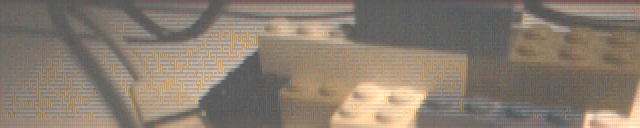
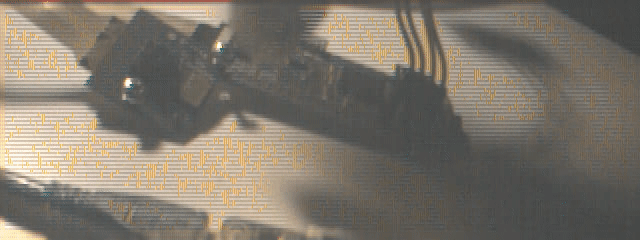
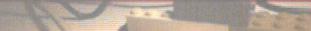
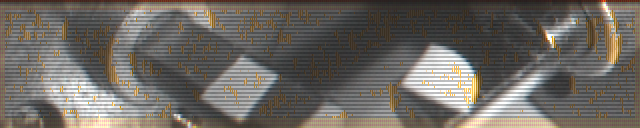
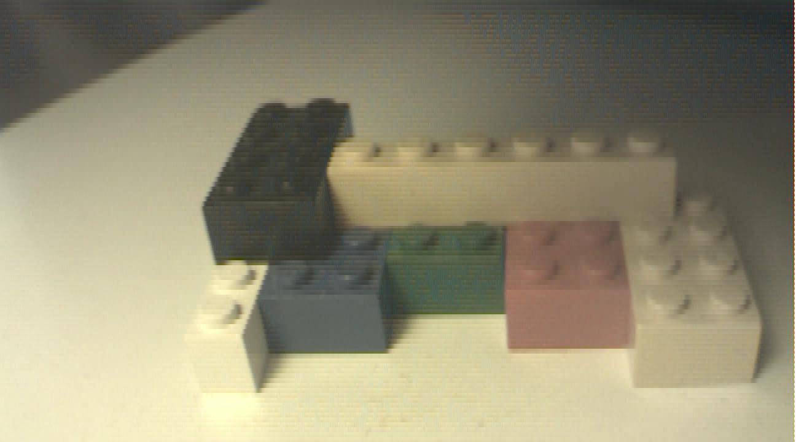

Raspiraw: An example app that receives data directly from CSI sensors
on the Raspberry Pi.

The register sets for OV5647 and IMX219 are often under NDA, which means
that support can not be offered over their contents without breaking
those NDAs. Anything added here by RPF/RPT has to be demonstrable as
already being in the public domain, or from 3rd parties having
reverse engineered how the firmware is working (eg by listening to the
I2C communications).

The raw Bayer format frames captured by **raspiraw** can be converted to .ppm images by modified **dcraw** image processing app: [https://github.com/6by9/dcraw](https://github.com/6by9/dcraw)

Supported sensors:

	adv7282m
	imx219
	ov5647

## raspiraw command line options

Table of contents:

	$ raspiraw

	raspiraw Camera App 0.0.1

	-?, --help	: This help information
	-md, --mode	: Set sensor mode <mode>
	-hf, --hflip	: Set horizontal flip
	-vf, --vflip	: Set vertical flip
	-e, --ss	: Set the sensor exposure time (not calibrated units)
	-g, --gain	: Set the sensor gain code (not calibrated units)
	-o, --output	: Set the output filename
	-hd, --header	: Write the BRCM header to the output file
	-t, --timeout	: Time (in ms) before shutting down (if not specified, set to 5s)
	-sr, --saverate	: Save every Nth frame
	-b, --bitdepth	: Set output raw bit depth (8, 10, 12 or 16, if not specified, set to sensor native)
	-c, --cameranum	: Set camera number to use (0=CAM0, 1=CAM1).
	-eus, --expus	: Set the sensor exposure time in micro seconds.
	-y, --i2c	: Set the I2C bus to use.
	-r, --regs	: Change (current mode) regs
	-hi, --hinc	: Set horizontal odd/even inc reg
	-vi, --vinc	: Set vertical odd/even inc reg
	-f, --fps	: Set framerate regs
	-w, --width	: Set current mode width
	-h, --height	: Set current mode height
	-tp, --top	: Set current mode top
	-hd0, --header0	: Sets filename to write the BRCM header to
	-ts, --tstamps	: Sets filename to write timestamps to
	-emp, --empty	: Write empty output files
	$

## base options

...

	-md, --mode	: Set sensor mode <mode>

Range is 1-7.

...

	-o, --output	: Set the output filename

For recording more than one frame specify "C printf integer format strings" as part of the filename.
Example: ... -o /dev/shm/out.%04d.raw ...

	-hd, --header	: Write the BRCM header to the output file

If selected, this prepeneds each stored frame with a 32KB header (needed for **dcraw** being able to process the raw frame). An alternative (needed for high framerate capturing) is option -hd0 (see below section), which allows **dcraw** to process the captured frames later as well.

...

	-sr, --saverate	: Save every Nth frame

Per default this is 20, allowing to capture frames to slow SD cards. In high framerate section, storing on (fast) ramdisk allows to use "-sr 1" (store all frames).

...

	-y, --i2c	: Set the I2C bus to use.

Range is 0-2.

## high frame rate options

Lookup ov5647, imx219 or adv7282m data sheets for register details.

#### I2C register setting options

	-r, --regs	: Change (current mode) regs

Allows to change sensor regs in selected sensor mode. Format is a semicolon separated string of assignments.
An assignment consists of a 4 hex digits register address, followed by a comma and one or more 2 hex digit byte values.
Restriction: Only registers present in selected sensor mode can be modified. Example argument: "380A,003C;3802,78;3806,05FB".
In case more than one byte appears after the comma, the byte values get written to next addresses.

	-hi, --hinc	: Set horizontal odd/even inc reg

Sets the horizontal odd and even increment numbers. Argument is a 2 hex digits byte. "-hi xy" is convenience shortcut for "3814,xy" in --regs for ov5647 sensor. Lookup the sensor mode registers for your sensor header file for default values. TODO: Needs to be extended to deal with the other sensors as well.

	-vi, --vinc	: Set vertical odd/even inc reg

Sets the vertical odd and even increment numbers. Argument is a 2 hex digits byte. "-vi xy" is convenience shortcut for "3815,xy" in --regs for ov5647 sensor. TODO: Needs to be extended to deal with the other sensors as well.

	-f, --fps	: Set frame rate regs

Sets the requested frame rate; argument is a floating point number. All sensors but adv7282m sensor are supported.

#### Sensor mode setting options

The following options allow to overwrite some sensor mode settings for current sensor mode.

	-w, --width	: Set current mode width

Sets the width value of current mode.

	-h, --height	: Set current mode height

Sets the height value of current mode, and sensor mode regs.

	-tp, --top	: Set current mode top

Sets top line in case --vinc setting jumps two or more lines. The tools *_B* modes make use of it to capture bottom half of fov.

#### File output settings

	-hd0, --header0	: Write the BRCM header to output file

For high frame rate modes writing BRCM header to each file is a bottleneck.
So this option is a replacement for "--header"/"-hd" option.
Instead of writing header to each frame file, it is written to specified output file only.
For decoding ith frame with **dcraw** later, you need to concatenate specified output file and frame i and store somewhere, then **dcraw** that file.

	-ts, --tstamps	: Write timestamps to output file

With this option timestamps for the captured frames get written to specified output file.
This happens after video has been captured, so does not negatively affect capture frame rate.
Format: "delta,index,timestamp\n"

Timestamp distribution analysis can be easily done this way:

	$ cut -f1 -d, tstamps.csv | sort -n | uniq -c
	      1
	     13 1499
	     17 1500
	     31 1501
	    147 1502
	    376 1503
	     22 1504
	     33 1505
	     14 1506
	      3 1507
	      1 3005
	      2 3006
	$

This shows that frame deltas are 1503&micro;s &plusmn; 4&micro;s, which corresponds to 1,000,000/1503=665.3fps.
Three frame skips happened during recording, and their indices can be easily determined by:

	$ grep "^3" tstamps.csv
	3006,2,6027843627
	3005,85,6027969857
	3006,554,6028676146
	$

So we know that frames 0085-0553 have no frame skips. All tools do this timestamp analysis for you.

	-emp, --empty	: Write empty output files

This option allows to determine the maximal frame rate **raspiraw** callback will be triggered. Only empty files will be written for the frames, but the filenames allow to count how many. This would be an example use:

	raspiraw -md 7 -t 3000 -emp {some options from this section} -sr 1 -o /dev/shm/out.%04d.raw 2>/dev/null

Using **/dev/shm** ramdisk for storage is essential for high frame rates. You precede this command by "rm /dev/shm/out.&ast;.raw" and do "ls -l /dev/shm/out.&ast;.raw | wc --lines" afterwards to determine the number of frames written ("-sr 1" means saverate 1 or writing all frames received from camera). "--empty" option allows to determine upper bounds for the absolute maximal frame rate achievable for a given set of high frame rate options.

#### Examples:

This is an example making use of most high frame rate command line options:

	$ rm /dev/shm/out.*.raw
	$ raspiraw -md 7 -t 1000 -ts tstamps.csv -hd0 hd0.32k -h 64 --vinc 1F --fps 660 -r "380A,0040;3802,78;3806,0603" -sr 1 -o /dev/shm/out.%04d.raw 2>/dev/null
	Using i2C device /dev/i2c-0
	$ ls -l /dev/shm/out.*.raw | wc --lines
	660
	$

This command captures video from ov5647 camera on CSI-2 interface:
* based on 640x480 mode (-md 7)
* captures for 1s (-t 1000)
* stores &micro;s timestamps in file tstamps.csv (-ts)
* stores BCRM header needed for **dcraw** only once in file hd0.32k  (-hd0)
* sets frame capture height to 64 (-h 64)
* increases line skipping to 1 and 15 instead of 3 and 5. Results in doubling vertical covered area (--vinc 1F, sum 8 vs 16). 1F shows colors (see below), 3D result is pale
* asks for 660 fps (--fps 660)
* sets some ov5647 registers (380A,0040;3802,78;3806,0603)
* sets saverate to 1 (save all frames)
* outputs in "/dev/shm" ramdisk files starting with "out.0001.raw"
* redirects standard error output (lots of mmal messages) to /dev/null (2>/dev/null)

For being able to convert frame 123 captured frame with **dcraw** these steps are necessary (because of -hd0):

	cat hd0.32k /dev/shm/out.0123.raw > out.0123.raw
	dcraw out.0123.raw

Since line scanning speed was doubled, the captured 128x64 frames need to be stretched by factor 2.
You can use this small C code and know exactly what happens, or any other stretching program (gimp, netpbm tools, ...), the result is still a .ppm format file:
[double.c](tools/double.c)

	double out.0123.ppm > out.0123.ppm.d

This frame was captured with 665fps. It is surprisingly colorful despite only 1.5ms shutter time:

Currently the capturing tools do not use --regs option anymore. This option keeps available trying out things quickly.

#### Creation of .ogg video from **dcraw** processed and stretched .ppm frames

First you need to convert the .ppm frames you are interested in into .png format, eg. with netpbm tools:

	pnmtopng out.0123.ppm.d > out.0123.ppm.d.png

This gstreamer pipeline creates .ogg video. You can choose frame rate the video should play with (eg. 1fps for very slow motion), and start index of the frames to be taken.

	gst-launch-1.0 multifilesrc location="out.%04d.ppm.d.png" index=300 caps="image/png,framerate=\(fraction\)1/1" ! pngdec ! videorate ! videoconvert ! videorate ! theoraenc ! oggmux ! filesink location="$1.ogg"

This is now part of raw2ogg2anim tool.

#### Creation of animated .gif from .ogg video

You can create high quality animated .gif from .ogg video with ffmpeg based [gifenc.sh](tools/gifenc.sh). You only need to adjust **fps** and **scale** in **filters** variable of that script to match what you want.

	gifenc.sh $1.ogg $1.anim.gif

Sample: 360fps 640x120 (rescaled to 640x240) video taken with v1 camera, played 25x slowed down:

This is now part of raw2ogg2anim tool.

## raspiraw usage

#### do once

You have to clone the repo.
Then "cd raspiraw; ./buildme".
Finally add this line to your ~/.bashrc.

	$ tail -1 ~/.bashrc 
	PATH=~/raspiraw:~/raspiraw/tools:$PATH
	$

#### do once after reboot or use of raspistill/raspivid

Execute camera_i2c to make raspiraw work.

	$ camera_i2c 
	setting GPIO for board revsion: a01041
	A+, B+, and B2 all revisions - I2C 0 on GPIOs 28 & 29. GPIOs 32 & 41 for LED and power
	$

#### tools usage

There are quite soome tools in [tools directory](tools/).
They allow to do a video capture with frame delay and frame skip analysis with
just a single command.
And to repeat the command if you do not like the analysis.

There are several tools for capturing. [640x128_s](tools/640x128_s) creates 640x128
frames while only capturing 64 lines. Stretching is needed in post processing.
[640x128](tools/640x128) captures 640x128 frames as well, but all 128 lines. There
is a minor difference in viewing the frames, and a bigger difference in capturing
framerate that can be achieved. Stretched 640x128 frames can be captured at 665(502)
fps on Pi 2B/3B(Pi Zero[W]), whereas full capturing of 128 lines allows for 350fps
(only).

This table gives modes and framerates possible with raspiraw.

|format        | Pi Zero [W] |   Pi 2B/3B |
|:-------------|------------:|-----------:|
|640x480       |         90  |         90 |
|640x480_s     |        180  |        180 |
|640x240[_B]   |        180  |        180 |
|640x240[_B]_s |        360  |        360 |
|640x128  / _s |  350 / 502  |  350 / 665 |
|640x64   / _s |  502 / 543  |  665 / 750 |
|640x32        |  543        |  750       |
|640x416_s     |        210  |        210 |
|640x400_s     |        220  |        220 |
|2592x1944_s   |         30  |         30 |
|1296x730_s    |         98  |         98 |
|1296x720_S    |        190  |        190 |
|framerate for normal / stretched | _B is "bottom half" | _S is "4th rows"

Sample:

	$ 640x128_s 1200
	removing /dev/shm/out.*.raw
	capturing frames for 1200ms with 659fps requested
	794 frames were captured at 665fps
	frame delta time[us] distribution
	      1 
	    168 1502
	    623 1503
	      2 3006
	after skip frame indices (middle column)
	3006,2,9698007408
	3006,275,9698419172
	$

[raw2ogg2anim ](tools/raw2ogg2anim) is script allowing you to create an .ogg video
and an animated .gif.
Specify output file prefix for .ogg video and .anim.gif animated gif created. Then
specify frame start and stop index as well, and the target framerate. Optionally
you can add "d"/"dd" argument for stretching each frame by factor of 2/4 vertically
before generation of output. "d"/"dd" option is used by "_s"/"_S" mode tools.

	$ ~/raspiraw/tools/raw2ogg2anim
	format: raw2ogg2anim vname first last fps [d[d]]
	$ 

## Where is the limit?

Above sample did capture 640x128 frames (stretched) at 665fps. It is possible to
capture 640x64 stretched frames with 900fps!
[https://www.raspberrypi.org/forums/viewtopic.php?f=63&t=109523&p=1246776#p1246776](https://www.raspberrypi.org/forums/viewtopic.php?f=63&t=109523&p=1246776#p1246776)

Sharp and well lighted video can be taken with NoIR camera with lense and 3W
infrared LED. This is 640x128 frame from video taken at 665fps:

This is 1296x720_S format frame taken at 190fps, only every 4th row gets captured
(allowing for high framerate while keeping fov), and post processing has to call
"double" tool two times for each frame:

